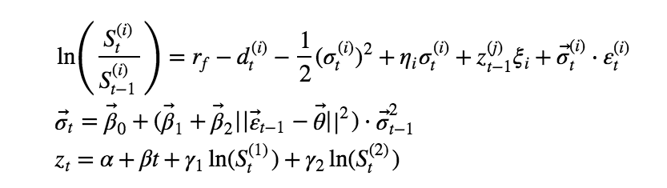
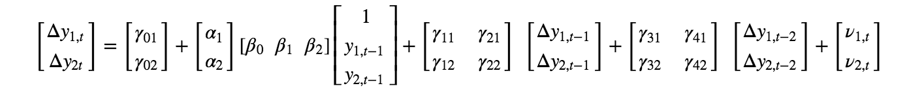
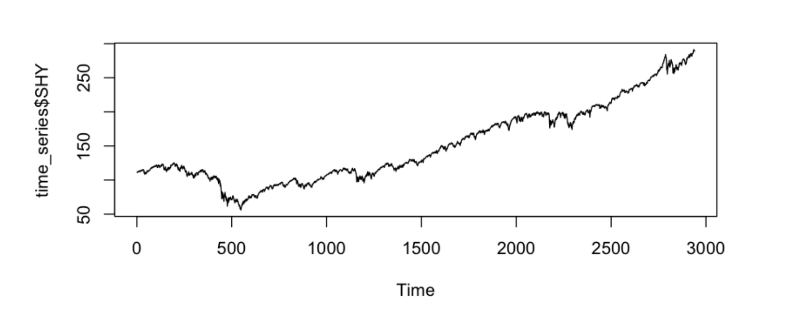
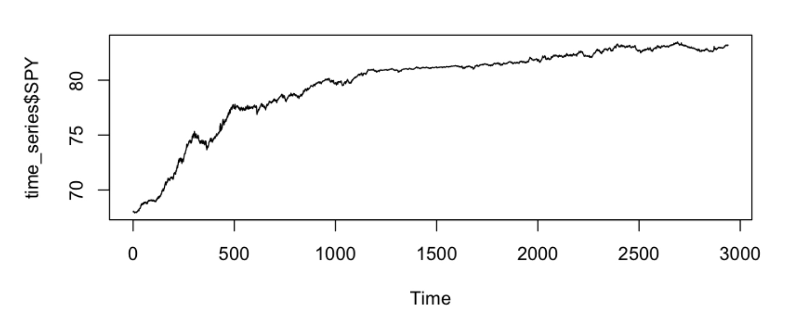
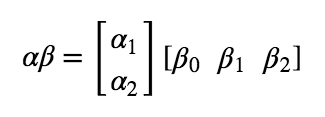

# Option Pricing with Cointegrated Assets

### Notebook by [Marco Tavora](https://marcotavora.me/)

<br>

<br>

## Introduction

A simple model for option hedging based on cointegrated vectors is:

<br>
<br>
<p align="center">
  
</p>
<br>

The inclusion of a *stationary* process z presupposes that in the long-run, stationarity is eventually achieved. The volatility is a simple GARCH(1,1) process. To control for growth and violation of mean reverting behavior, we added a deterministic term to z process.

## Conceptual Bird's Eye Review

### Vector Error Correction Model VECM

The VECM model is given by:

<br>
<p align="center">
  
</p>

where the components of the **y** vector are the SPY and the SHY series. If both series are cointegrated, this information is included in the model via error correction terms. 


```
# install.packages('ggplot2')
# install.packages('xts')
# install.packages('quantmod')
# install.packages('broom')
# install.packages('tseries')
# install.packages("kableExtra")
# install.packages("knitr")
# install.packages("vars")
# install.packages("urca")

```

To load the data we will use the library `quantmod` which contains the function `getSymbols`. 

From the [documents](https://www.rdocumentation.org/packages/quantmod/versions/0.4-13/topics/getSymbols)

> getSymbols is a wrapper to load data from various sources, local or remote.

In our case we will load data from Yahoo Finance.

```
rm(list=ls()) 
library(tseries)
library(dynlm)
library(vars)
library(nlWaldTest) 
library(lmtest)
library(broom) 
library(car)
library(sandwich)
library(knitr)
library(forecast) 
library(quantmod)

setSymbolLookup(SHY='yahoo',SPY='yahoo')
getSymbols(c('SHY','SPY'))  

```
Defining `y1` and `y2` as the adjusted prices and joining them:

```
y1 <- SPY$SPY.Adjusted
y2 <- SHY$SHY.Adjusted
time_series <- cbind(y1, y2)
print('Our dataframe is:')
colnames(time_series) <- c('SHY', 'SPY') 
head(time_series)

```
We can check for stationary of the series individually:

```
adf.test(time_series$SHY)
adf.test(time_series$SPY)
```
The output is:
```
	Augmented Dickey-Fuller Test

data:  time_series$SHY
Dickey-Fuller = -1.5363, Lag order = 14, p-value = 0.7747
alternative hypothesis: stationary

	Augmented Dickey-Fuller Test

data:  time_series$SPY
Dickey-Fuller = -3.7478, Lag order = 14, p-value = 0.02158
alternative hypothesis: stationary

```
The p-values are obtained using:

```
print('p-values:')
adf.test(time_series$SHY)$p.value
adf.test(time_series$SPY)$p.value
```
giving:
```
[1] "p-values:"
0.774665887814869
0.0215848302364735

```
Plotting the series we obtain:
```
par(mfrow = c(2,1))
plot.ts(time_series$SHY,
        type='l')
plot.ts(time_series$SPY, 
        type='l')

```

<br>
<p align="center">
  
</p>
<br>

<br>
<p align="center">
  
</p>
<br>

### Johansen Test for Cointegration

The most well known cointegration test is the Johansen test which estimates the VECM parameters and determines whether the determinant of 

br>
<p align="center">
  
</p>

is zero or not. If the determinant is not zero, the series are cointegrated.

```
library(urca)

johansentest <- ca.jo(time_series, type = "trace", ecdet = "const", K = 3)
summary(johansentest)

```
The result is:
```
###################### 
# Johansen-Procedure # 
###################### 

Test type: trace statistic , without linear trend and constant in cointegration 

Eigenvalues (lambda):
[1] 2.248927e-02 3.620157e-03 4.437196e-18

Values of teststatistic and critical values of test:

          test 10pct  5pct  1pct
r <= 1 | 10.65  7.52  9.24 12.97
r = 0  | 77.46 17.85 19.96 24.60

Eigenvectors, normalised to first column:
(These are the cointegration relations)

             SHY.l3      SPY.l3  constant
SHY.l3      1.00000      1.0000   1.00000
SPY.l3    -84.59851    163.3147  -8.78908
constant 6927.78683 -12622.5372 543.67420

Weights W:
(This is the loading matrix)

            SHY.l3        SPY.l3      constant
SHY.d 2.147229e-05  1.049741e-04 -1.531138e-17
SPY.d 2.088562e-05 -1.870590e-06  1.148836e-17
```

The lines r=0 and r<= 1 are the actual results of the test. More specifically:

- line r=0: these are the results of the hypothesis test with null hypothesis $r=0$. More concretely, this test checks if the matrix has zero rank. In the present case the hypothesis is rejected since the test variable is well above the $1\%$ value;
- line r<=1: these are the results of the hypothesis test $r\le 1$. Now since the test value is below the $1\%$ value value we fail to reject the null hypothesis. Hence we conclude that the rank of $\alpha \beta$ is 1 and therefore the two series are cointegrated and we can use the VECM model.

Note that if hypotheses were reject we would have r=2 corresponding to two stationary series.

### Fitting the VECM

```
t <- cajorls(johansentest, r = 1)
t

```

## TO BE CONTINUED

