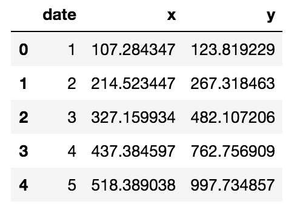

# Time-Series using ARMAX in Python
&nbsp;&nbsp;&nbsp;&nbsp;&nbsp;&nbsp;&nbsp;&nbsp;&nbsp;&nbsp;&nbsp;&nbsp;&nbsp;&nbsp;&nbsp;&nbsp;&nbsp;&nbsp;&nbsp;
      
## Introduction

A simple case of ARMAX process is:

&nbsp;&nbsp;&nbsp;&nbsp;

where  is a covariate. For concreteness, let us consider the following data set:

  

 

