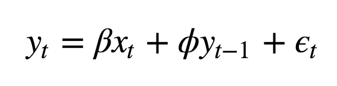

# Time-Series using ARMAX in Python
&nbsp;&nbsp;&nbsp;&nbsp;&nbsp;&nbsp;&nbsp;&nbsp;&nbsp;&nbsp;&nbsp;&nbsp;&nbsp;&nbsp;&nbsp;&nbsp;&nbsp;&nbsp;&nbsp;
      

  <a href="#intro"> Introduction </a> •
  <a href="#data"> Data </a> •

## Introduction

A simple case of ARMAX process is:

&nbsp;&nbsp;&nbsp;&nbsp;

  

where x is a covariate. Note that the covariate coefficient is not straightforward to interpret. Its value is not, as in the case of linear regressions, the effect of x on y when the former increases by one unit, but its interpretation depends on the previous values of the response y.

## Data

For concreteness, let us consider the following data set:

  

 

